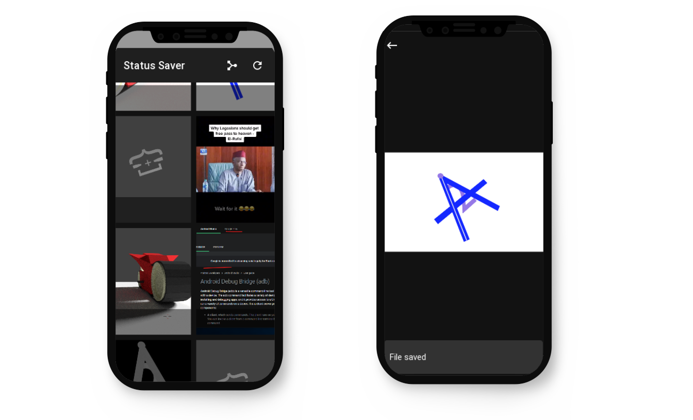

# Status Saver

mobile app that saves view whatsapp status media to your local storage.



# Features

**Save photos and vidoes**

**Merge clips into a single video** []()

**NOTE:** Currently support only photos saving

# Compile

**Use Buildozer to compile the app**

```bash

pip install buildozer

```

<p align="left"> Follow buildozer <a href="https://buildozer.readthedocs.io/en/latest/">documentation </a>
